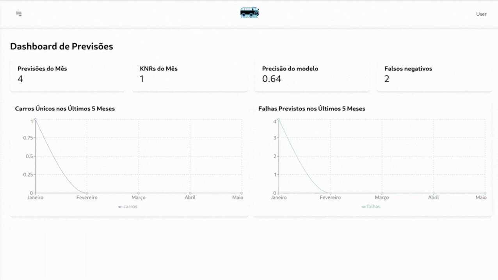

# Inteli - Instituto de Tecnologia e Liderança 

<p align="center">

</p>

# Grupo: Fillmore

## Vídeo de demonstração



[Demonstração da Solução Final](https://www.youtube.com/watch?v=rNgzF6gbDT4)

## Documentação

  A documentação pode ser encontrada no botao abaixo:

  [![Button Click]][Link]

  [Button Click]: https://img.shields.io/badge/Documentação-37a779?style=for-the-badge
  [Link]: https://inteli-college.github.io/2024-2A-T08-EC07-G04/


## :student: Integrantes:

- <a href="https://www.linkedin.com/in/gustavo-gouveia-583185271//">Gustavo Gouveia</a>
- <a href="https://www.linkedin.com/in/gustavo-machado-esteves-453b81248/">Gustavo Machado Esteves</a>
- <a href="https://www.linkedin.com/in/lidiamariano/">Lídia Cruz Mariano</a>
- <a href="https://www.linkedin.com/in/m%C3%A1rio-ventura-medeiros-123682291/">Mário Ventura Medeiros</a>
- <a href="https://www.linkedin.com/in/olincosta/">Ólin Medeiros Costa</a>
- <a href="https://www.linkedin.com/in/rafaelarojas/">Rafaela Rojas Lemos</a>

## :teacher: Professores:

### Orientador

- <a href="https://www.linkedin.com/in/murilo-zanini-de-carvalho-0980415b/">Murilo Zanini de Carvalho</a>

### Coordenadora

- <a href="https://www.linkedin.com/in/michele-bazana-de-souza-69b77763/">Michele Bazana de Souza</a>

### Instrutores

- <a href="https://www.linkedin.com/in/gui-cestari/">Guilherme Cestari</a>
- <a href="https://www.linkedin.com/in/rafaelmatsuyama/">Rafael Matsuyama</a>
- <a href="https://www.linkedin.com/in/lisane-valdo/">Lisane Valdo</a>
- <a href="https://www.linkedin.com/in/ricardo-missori/">Ricardo José Missori</a>
- <a href="https://www.linkedin.com/in/monica-anastassiu-d-sc-2568522/">Monica Anastassiu</a>
- <a href="https://www.linkedin.com/in/andr%C3%A9-leal-a57b2065/">André Leal</a>


## :memo: Descrição do projeto
O projeto, realizado em parceria com a Volkswagen, visa desenvolver um modelo preditivo e uma plataforma web para a visualização dos resultados. O modelo será treinado utilizando os dados fornecidos pela empresa, como resultados de testes, descrições de falhas e status de predições. A partir desses dados, o modelo terá a capacidade de prever possíveis falhas nos veículos, permitindo a potencial eliminação da etapa de rodagem, o que resultará em significativa redução de custos e benefícios ambientais.

A plataforma web que implementará o modelo incluirá funcionalidades para a inserção de novos dados, exibição imediata dos resultados das predições e uma interface para visualização dos dados coletados por meio de dashboards interativos.

### Manutenção preditiva

## Problema
 Temos a necessidade ser mais assertivos no tipo de inspeção que devemos realizar em determinados veículos na rodagem

## Inicialização

Para inicializar a documentação do projeto localmente, siga os passos abaixo:

### Pré-requisitos
- Python3.X
- Docker

### Instruções
Siga o passo a passo abaixo para iniciar a aplicação:
1. Em primeiro lugar, vá para o diretório ```src```:
```bash
cd src
```
2. Em seguida, altere as permissões da pasta ```postgres```:
```bash
sudo chdmod 777 -R 777 postgres/
```
3. Caso seja sua primeira vez utilizando a Docker, execute o comando:
```bash
sudo systemctl start docker
```
4. Por fim, execute o compose:
```bash
docker compose up --build
```
## 📁 Estrutura de pastas
```plaintext
└── 2024-2A-T08-EC07-G04
    ├── .github
    │   └── workflows
    ├── docs
    │   ├── sprint1
    │   ├── sprint2
    │   ├── sprint3
    │   ├── sprint4
    │   ├── sprint5
    │   └── intro.md
    ├── src
    │   ├── backend
    │   │   ├── alembic
    │   │   ├── controllers
    │   │   ├── model
    │   │   ├── models
    │   │   ├── pocketbase
    │   │   ├── routes
    │   │   ├── utils
    │   │   ├── alembic.ini
    │   │   ├── Dockerfile
    │   │   └── main.py
    │   ├── frontend
    │   │   ├── node_modules
    │   │   ├── public
    │   │   └── src
    │   ├── data
    │   ├── notebook
    │   ├── pocketbase_data
    │   ├── postgres
    │   ├── docker-compose.yml
    │   ├── .gitignore
    │   └── requirements.txt
    ├── .gitignore
    └── README.md
```
## Histórico de lançamentos

### Sprint 1
- Economia Circular e Mapeamento do Ciclo de Produção e Consumo
- Modelo Inicial
- Apresentação dos Documentos de Análise de Negócios do Projeto
- Requisitos de Viabilidade Técnica
  
### Sprint 2
- Deploy do Modelo com uma API de Interface
- API em FastAPI
- Modelo implementado com RNN
- Wireframe da Solução

### Sprint 3
- Dockerização da Aplicação
- Inicio do Frontend
- Remodelagem do banco de dados
- Justificativa da não utilização de DataLake
- Descrição das rotas do backend

### Sprint 4
- Projeto de Fluxo de Retreinamento do modelo
- Construção do processo de ETL
- Pipeline de Treinamento do Modelo
- Visualização de Dados
- Integração Backend e Frontend

### Sprint 5
- Finalização do Backend e Frontend
- Migrar aplicação para a Cloud
- Prova de conceito
- Finalização da Documentação


## Licença


<p xmlns:cc="http://creativecommons.org/ns#" xmlns:dct="http://purl.org/dc/terms/"><a property="dct:title" rel="cc:attributionURL" href="https://github.com/Inteli-College/2024-2A-T08-EC07-G04">Fillmore</a> by <span property="cc:attributionName">Inteli - Gustavo Machado, Rafaela Rojas, Lídia Cruz Mariano, Mário Ventura, Ólin Medeiros, Gustavo Gouveia</span> is licensed under <a href="https://creativecommons.org/licenses/by/4.0/?ref=chooser-v1" target="_blank" rel="license noopener noreferrer" style="display:inline-block;">CC BY 4.0</a></p>
