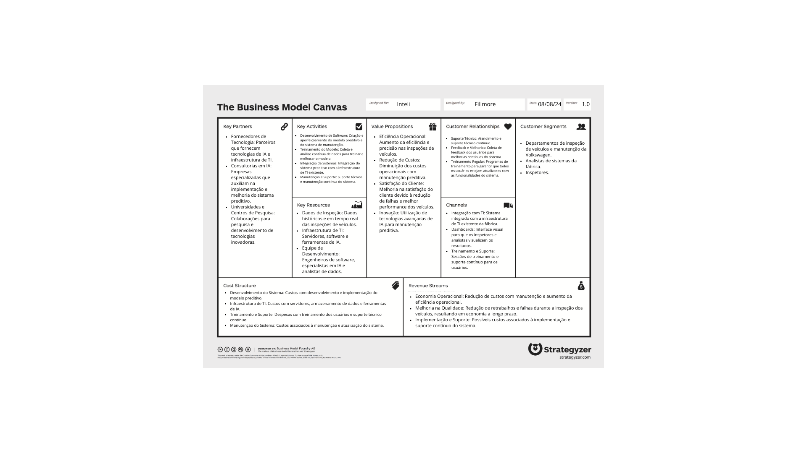
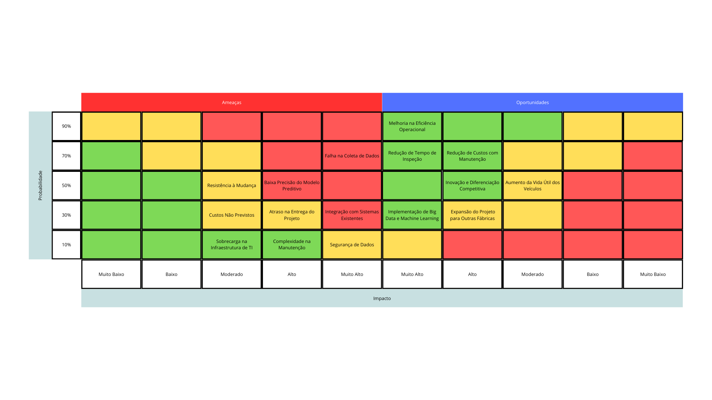

# Apresentação dos Documentos de Análise de Negócios do Projeto

## 1. Introdução ao Business Model Canvas

O **Business Model Canvas** é uma ferramenta estratégica essencial para o planejamento e a visualização das principais áreas de um negócio. Desenvolvido por Alexander Osterwalder, este modelo permite que empresas mapeiem, entendam e inovem suas estratégias de negócio em um único quadro visual. Ele é composto por nove blocos principais que cobrem diferentes aspectos do negócio: Segmentos de Clientes, Propostas de Valor, Canais, Relacionamento com Clientes, Fontes de Receita, Recursos Principais, Atividades-chave, Parcerias Principais e Estrutura de Custos.

**Objetivo:**

O objetivo do Business Model Canvas é proporcionar uma visão clara e concisa de como o negócio gera, entrega e captura valor. Ao preencher cada um dos blocos, é possível identificar pontos fortes, oportunidades de melhoria e áreas de inovação, além de facilitar a comunicação e o alinhamento entre todas as partes envolvidas no projeto.

**Utilização no Projeto:**

No contexto do projeto de manutenção preditiva para a Volkswagen do Brasil, o Business Model Canvas foi utilizado para estruturar e delinear as principais atividades, recursos e parcerias necessárias para a implementação bem-sucedida do sistema preditivo. Ele também detalha as fontes de receita e a estrutura de custos, garantindo que todos os aspectos financeiros e operacionais estejam alinhados com a proposta de valor do projeto.

**Imagem do Business Model Canvas:**

[Business Model Canvas](https://www.canva.com/design/DAGDPG8976Y/tf-Zg0P5Mq_P0Bwiepr2Mg/edit?utm_content=DAGDPG8976Y&utm_campaign=designshare&utm_medium=link2&utm_source=sharebutton)

**Explicação do Conteúdo:**

- **Segmentos de Clientes:** Este bloco define os diferentes grupos de pessoas ou organizações que uma empresa busca alcançar e atender. É aqui que se define e segmenta o público-alvo, identificando os principais grupos de clientes que serão beneficiados pelo projeto, como os departamentos de qualidade de veículos e manutenção da Volkswagen.
- **Proposta de Valor:** Este bloco descreve o conjunto de razões pelas quais os clientes optarão pelo seu produto ou serviço. A proposta de valor deve destacar os benefícios e o valor único que o produto ou serviço oferece. No caso do projeto, isso pode incluir o aumento da eficiência operacional e a redução de custos na Volkswagen.
- **Canais:** Esta seção descreve como o seu negócio se comunica e distribui o produto ou serviço aos clientes. Os canais podem ser diretos (proprietários, pertencentes à própria empresa) ou indiretos (canais de terceiros). Para o projeto, isso pode envolver a integração com sistemas de TI existentes e dashboards de visualização.
- **Relacionamento com Clientes:** Este bloco descreve as estratégias e os meios que serão utilizados para estabelecer e manter o relacionamento com os clientes. Essas relações podem variar de pessoais a automatizadas e podem ter o objetivo de conquistar novos clientes ou reter os atuais. No projeto, isso pode ser feito através de suporte técnico contínuo e feedback regular.
- **Fontes de Receita:** Este bloco representa como o seu negócio vai gerar receita através da venda de produtos e serviços, e as formas de capturar esse valor. No caso do projeto, a geração de valor financeiro ocorre principalmente por meio da economia operacional e melhorias na qualidade.
- **Recursos Principais:** Este bloco descreve os recursos mais importantes para o funcionamento do modelo de negócios. Para o projeto, os recursos essenciais incluem dados de inspeção e infraestrutura de TI.
- **Atividades-chave:** Este bloco descreve as ações mais importantes que a empresa deve realizar para que o modelo de negócios funcione. As atividades-chave podem estar ligadas à produção, prestação de serviços ou tarefas administrativas. No contexto do projeto, isso inclui o desenvolvimento e o treinamento do modelo preditivo.
- **Parcerias Principais:** Este bloco refere-se à rede de fornecedores e parceiros que ajudam a otimizar e reduzir os riscos do negócio. Qualquer tarefa ou insumo essencial fornecido por outra empresa que garanta o funcionamento do modelo de negócios deve ser listado aqui. No projeto, isso pode incluir fornecedores de tecnologia e consultorias em IA.
- **Estrutura de Custos:** Este bloco do Business Model Canvas aborda todos os custos envolvidos na operação do modelo de negócios. Esses custos geralmente derivam dos blocos de recursos, atividades e parcerias-chave. No projeto, os principais custos incluem o desenvolvimento do sistema e a infraestrutura de TI.

## 2. Introdução à Matriz de Risco

A **Matriz de Risco** é uma ferramenta fundamental para o gerenciamento de riscos, utilizada para avaliar e priorizar os riscos de um projeto com base em sua probabilidade de ocorrência e impacto potencial. Esta matriz organiza os riscos em um formato de grade, onde um eixo representa a probabilidade de ocorrência e o outro eixo representa o impacto no projeto. Os quadrantes resultantes permitem categorizar os riscos como baixos, moderados, altos ou extremos.

**Objetivo:**

O principal objetivo da Matriz de Risco é identificar quais riscos requerem atenção imediata e ações de mitigação, bem como quais oportunidades podem ser exploradas para beneficiar o projeto. Ela permite uma gestão proativa dos riscos, ajudando a garantir que o projeto permaneça no caminho certo em termos de cronograma, orçamento e qualidade.

**Utilização no Projeto:**

Para o projeto de manutenção preditiva da Volkswagen, a Matriz de Risco foi utilizada para identificar e avaliar os principais riscos que podem afetar o desenvolvimento e a implementação do sistema preditivo. A matriz também destaca as oportunidades que podem ser aproveitadas para maximizar o valor do projeto.

**Imagem da Matriz de Risco:**

[Matriz de Risco](https://www.canva.com/design/DAGNXaZ1txY/TNvaRr3aX0vE98Dg0E6aFQ/edit?utm_content=DAGNXaZ1txY&utm_campaign=designshare&utm_medium=link2&utm_source=sharebutton)

**Explicação do Conteúdo:**

- **Ameaças:** O lado esquerdo da matriz identifica e avalia os principais riscos que podem impactar negativamente o projeto. Esses riscos variam de problemas técnicos, como falhas na coleta de dados, até desafios operacionais, como atrasos no cronograma e resistência à mudança.
- **Oportunidades:** O lado direito da matriz foca nas oportunidades que podem ser exploradas para melhorar o sucesso do projeto. Isso inclui melhorias na eficiência operacional, redução de custos e potencial expansão do projeto para outras fábricas.
- **Probabilidade e Impacto:** A matriz categoriza cada risco e oportunidade com base em sua probabilidade de ocorrência e impacto no projeto. Isso ajuda a priorizar as ações a serem tomadas, focando nos riscos mais críticos e nas oportunidades mais promissoras.

Para amenizar os impactos dos riscos da matriz de risco, é importante definir estratégias de mitigação específicas para cada risco, por isso selecionamos 3 dos maiores riscos:

## 1. Falha na Coleta de Dados
- **Descrição do Risco:** Problemas na coleta de dados podem levar à falta de informações essenciais para o modelo preditivo, comprometendo a qualidade das previsões.
- **Impacto Potencial:** Resultados imprecisos, decisões erradas, e possível retrabalho.

**Ações de Mitigação:**

- **Estabelecer Redundância de Fontes de Dados:** Utilizar múltiplas fontes de dados para garantir que, se uma fonte falhar, outra possa fornecer as informações necessárias.
- **Implementar Monitoramento Contínuo:** Desenvolver um sistema de monitoramento para verificar a qualidade e a consistência dos dados em tempo real, alertando quando a coleta de dados for interrompida ou apresentar anomalias.
- **Realizar Testes Regulares de Coleta de Dados:** Criar um cronograma de testes regulares para validar os processos de coleta de dados, verificando a integridade e a completude dos dados recebidos.
- **Treinamento da Equipe:** Capacitar a equipe responsável pela coleta de dados para identificar rapidamente problemas e corrigi-los de forma eficaz.

## 2. Baixa Precisão do Modelo Preditivo
- **Descrição do Risco:** O modelo preditivo pode apresentar baixa precisão devido a dados inadequados, sobreajuste (overfitting), subajuste (underfitting), ou erros de modelagem.
- **Impacto Potencial:** Tomada de decisão incorreta, perda de confiança dos usuários, e necessidade de retrabalho no desenvolvimento do modelo.

**Ações de Mitigação:**

- **Realizar Análise de Qualidade dos Dados:** Antes de alimentar o modelo, garantir que os dados sejam limpos, completos e relevantes.
- **Utilizar Validação Cruzada e Testes de Robustez:** Implementar técnicas de validação cruzada para avaliar a performance do modelo e garantir que ele generalize bem em diferentes cenários.
- **Iteração e Refinamento Contínuos do Modelo:** Monitorar continuamente o desempenho do modelo e ajustar hiperparâmetros ou a arquitetura conforme necessário.
- **Incluir Feedback dos Usuários:** Coletar feedback dos usuários finais para ajustar o modelo e melhorar a sua precisão, levando em consideração os casos de uso específicos.
- **Diversificar os Algoritmos de Modelagem:** Testar diferentes algoritmos e técnicas de aprendizado de máquina para encontrar a abordagem mais adequada ao problema específico.

## 3. Integração com Sistemas Existentes
- **Descrição do Risco:** Problemas ao integrar o novo sistema com os sistemas de TI já existentes na organização, resultando em falhas de comunicação ou incompatibilidades técnicas.
- **Impacto Potencial:** Interrupções no fluxo de trabalho, aumento de custos e atrasos na entrega do projeto.

**Ações de Mitigação:**

- **Realizar Análise de Compatibilidade Prévia:** Antes de iniciar a integração, conduzir uma análise detalhada para identificar possíveis incompatibilidades e pontos críticos.
- **Implementar Integração Incremental:** Adotar uma abordagem gradual de integração, testando cada componente antes de prosseguir para o próximo, reduzindo o risco de falhas globais.
- **Estabelecer Padrões e Protocolos de Comunicação:** Definir e documentar padrões de comunicação claros entre os sistemas para garantir que eles possam se comunicar efetivamente.
- **Desenvolver um Plano de Contingência:** Preparar um plano de contingência que inclua procedimentos para reverter rapidamente as mudanças em caso de problemas sérios durante a integração.
- **Colaborar com Especialistas em TI:** Envolver equipes de TI com experiência nos sistemas existentes desde o início do projeto para garantir um processo de integração suave.

Essas estratégias de mitigação podem ajudar a reduzir o impacto potencial dos riscos identificados, aumentando a probabilidade de sucesso do seu projeto.

## 3. Análise Financeira

### Introdução:
&emsp;&emsp;Nessa seção, abordaremos a análise financeira da prova de conceito e da implementação do projeto final, observando todos os custos a serem considerados, desde o desenvolvimento até a manutenção do servidor em nuvem.  
&emsp;&emsp;O projeto visa desenvolver um modelo preditivo capaz de identificar possíveis falhas no processo de montagem de carros nas fábricas da Volkswagen, assim reduzindo o número de "drive tests" realizados pela equipe da Volkswagen, gerando uma economia de tempo e de recursos.

### Proof of Concept (PoC)
&emsp;&emsp;A PoC, do inglês "Proof of Concept" (prova de conceito), é o experimento realizado previamente ao projeto final, com a finalidade de provar sua viabilidade. Pensando nisso, fizemos a análise financeira da implementação dessa prova de conceito, levando em conta os custos de hardware, que dizem respeito aos computadores utilizados no desenvolvimento, a mão de obra e o custo de manutenção em nuvem. Segue abaixo uma tabela com a análise completa:

| Descrição                                      | Quantidade | Custo Unitário | Valor Final   | Fonte |
| ---------------------------------------------- | ---------- | -------------- | ------------- | ------------------- |
| Hardware (computadores) | 3 | R$4.422,00 | R$13.266,00 | [Dell](https://www.dell.com/pt-br/shop/cty/pdp/spd/latitude-14-3440-laptop/ctol3440adl_p12h?redirectTo=SOC&tfcid=31768715&gacd=9657105-15015-5761040-275878141-0&dgc=ST&cid=71700000114503108&gad_source=1&gclid=Cj0KCQjw5ea1BhC6ARIsAEOG5pyFb_VRapQS8Ic_a-Cwq6DBVRaJ06WdP6QxzHP1y8CQvy-fPgNnFr4aAnq5EALw_wcB&gclsrc=aw.ds) |
| Engenheiros de Dados (Por 2 meses) | 2 | R$18.000,00 | R$36.000,00 | [Glassdoor](https://www.glassdoor.com.br/Salários/engenheiro-de-dados-salário-SRCH_KO0,19.htm#:~:text=A%20remuneração%20total%20mensal%20estimada,salários%20coletados%20de%20nossos%20usuários.) |
| Gestor de Projetos (Por 2 meses) | 1 | R$26.770,00 | R$26.770,00 | [Glassdoor](https://www.glassdoor.com.br/Salários/gerente-de-projetos-de-ti-salário-SRCH_KO0,25.htm#:~:text=A%20média%20salarial%20do%20cargo,%24%20805%20e%20R%24%203.508.) |
| Total de Mão de Obra | | | R$62.770,00 | |
| **Total Geral** |   |   | **R$76.036,00** | |
| Margem de lucro | 20% | | R$15.207,00 | |
| Subtotal | | | R$91.243,00 | |
| Imposto |  18% | | R$13.918,00 |  |
| **Preço Mínimo Aceitável** | | | **R$118.428,00** | |

&emsp;&emsp;Seguindo a análise acima, é possível observar o preço mínimo aceitável para o desenvolvimento da PoC, contemplando todos os gastos de material e mão de obra, aplicando uma margem de lucro válida e cumprindo todas as obrigações fiscais. Abaixo, observa-se a análise dos custos de manutenção desta PoC em nuvem.

| Serviço: | Quantidade | Valor/Mês: | Total: |
| --- | --- | --- | --- |
| Armazenamento | 256 GB | R$0,13 por GB | R$33,28 |
| ETL | 25 horas | R$2,41 por DPU-Hora | R$60,28 |
| Treinamento | 12 horas e meia | R$4,93 por hora | R$61,63 |
| Monitoramento | 256 GB | R$1,64 por GB | R$420,86 |
| Catalogação | 25 mil itens | R$0,55 a cada mil itens | R$13,70 |
| **Total Final** | | | **R$589,75** |

&emsp;&emsp;Foi possível chegar a essa precificação com base no site [AWS Pricing Calculator](https://calculator.aws/#/) e permite ter uma noção do custo mensal da manutenção do serviço na nuvem.

### Projeto final
&emsp;&emsp;Na análise financeira do projeto final, foram considerados custos ampliados, uma vez que a implementação demandará maior quantidade de recursos em termos de hardware, software, mão de obra, e custos de manutenção mais elevados. Abaixo, a tabela completa com os custos do projeto final:

| Descrição                                      | Quantidade | Custo Unitário | Valor Final   | Fonte |
| ---------------------------------------------- | ---------- | -------------- | ------------- | ------------------- |
| Hardware (computadores) | 6 | R$7.061,00 | R$42.366,00 | [Dell](https://www.dell.com/pt-br/shop/cty/pdp/spd/latitude-14-5450-laptop/cto01l5450bcc_p21?redirectTo=SOC&tfcid=31768715&gacd=9657105-15015-5761040-275878141-0&dgc=ST&cid=71700000114503108&gad_source=4&gclid=Cj0KCQjwiOy1BhDCARIsADGvQnBBiTftEtWcLGdI1hQbztwUDsmY606ieK9kg6cxyecXnQTJj5w7XNAaAneeEALw_wcB&gclsrc=aw.ds) | 
| Licenças de Software | 1 | R$300,00 | R$300,00 | |
| Desenvolvimento Customizado (100 horas) | 100 | R$50,00 | R$5.000,00 | |
| Engenheiros de Dados (Por 2 meses) | 3 | R$18.000,00 | R$54.000,00 | [Glassdoor](https://www.glassdoor.com.br/Salários/engenheiro-de-dados-salário-SRCH_KO0,19.htm#:~:text=A%20remuneração%20total%20mensal%20estimada,salários%20coletados%20de%20nossos%20usuários.) |
| Engenheiro de Software (Por 2 meses) | 2 | R$16.000,00 | R$32.000,00 | [Glassdoor](https://www.glassdoor.com.br/Salários/engenheiro-de-software-salário-SRCH_KO0,22.htm) |
| Gestor de Projetos (Por 2 meses) | 1 | R$26.770,00 | R$26.770,00 | [Glassdoor](https://www.glassdoor.com.br/Salários/gerente-de-projetos-de-ti-salário-SRCH_KO0,25.htm#:~:text=A%20média%20salarial%20do%20cargo,%24%20805%20e%20R%24%203.508.) |
| Total de Software | | | R$5.300,00 |  |
| Total de Mão de Obra | | | R$112.770,00 | |
| **Total Geral** |   |   | **R$160.436,00** | |
| Margem de lucro | 20% | | R$32.087,00 | |
| Subtotal | | | R$192.523,00 | |
| Imposto |  18% | | R$29.368,00 |  |
| **Preço Mínimo Aceitável** | | | **R$221.891,00** | |

&emsp;&emsp;A tabela acima reflete o preço mínimo aceitável para o desenvolvimento do projeto final, considerando todos os custos envolvidos e as devidas margens de lucro e impostos. A seguir, apresentamos os custos de manutenção do projeto em nuvem, que foram ampliados em relação à PoC devido ao maior volume de dados e processos.

| Serviço: | Quantidade | Valor/Mês: | Total: |
| --- | --- | --- | --- |
| Armazenamento | 1024 GB | R$0,13 por GB | R$133,12 |
| ETL | 100 horas | R$2,41 por DPU-Hora | R$241,12 |
| Treinamento | 50 horas | R$4,93 por hora | R$246,50 |
| Monitoramento | 1024 GB | R$1,64 por GB | R$1.683,46 |
| Catalogação | 100 mil itens | R$0,55 a cada mil itens | R$55,00 |
| **Total Final** | | | **R$2.359,20** |

&emsp;&emsp;Assim como a precificação da PoC, a tabela acima também foi feita utilizando o [AWS Pricing Calculator](https://calculator.aws/#/), porém com proporções muito maiores, visto que é referente a implementação final do projeto.