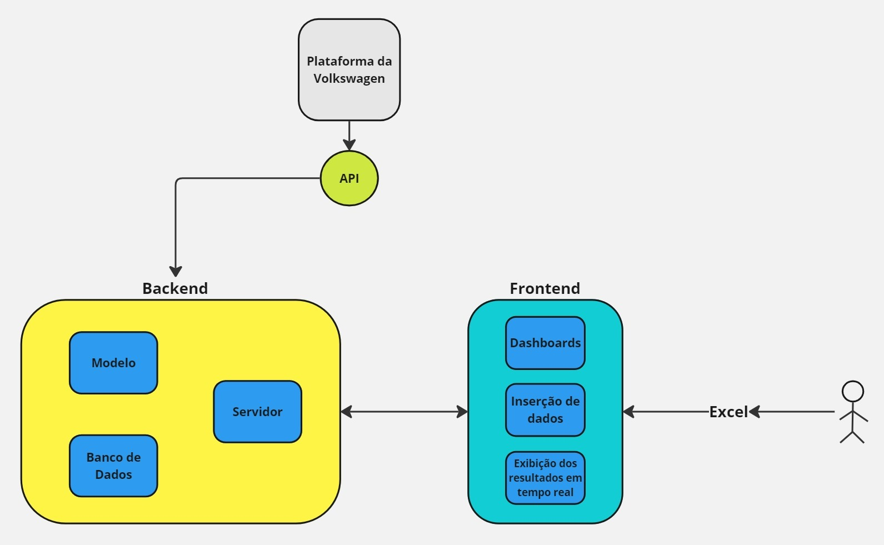

# Requisitos de Viabilidade Técnica

## Objetivo da Proposta Geral do Sistema
O projeto, realizado em parceria com a Volkswagen, visa desenvolver um modelo preditivo e uma plataforma web para a visualização dos resultados. O modelo será treinado utilizando os dados fornecidos pela empresa, como resultados de testes, descrições de falhas e status de predições. A partir desses dados, o modelo terá a capacidade de prever possíveis falhas nos veículos, permitindo a potencial eliminação da etapa de rodagem, o que resultará em significativa redução de custos e benefícios ambientais.

A plataforma web que implementará o modelo incluirá funcionalidades para a inserção de novos dados, exibição imediata dos resultados das predições e uma interface para visualização dos dados coletados por meio de dashboards interativos.

## Descrição objetiva dos elementos gerais que vão compor a solução inicial proposta (diagrama de blocos)
Em relação aos componentes do sistema podemos destacar os dados de entrada, modelo preditivo e plataforma web. Por meio de uma descrição mais detalhada a respeito de cada elemento. 
- **Dados de entrada**: É o conjunto de dados fornecidos pela empresa, incluindo resultados de testes, descrições de falhas e status das predições dos veículos. Os arquivos em questão estão maioria no formato Excel Spreadsheet (xlsx), e alguns em Comma-Separated Values (csv). Esses dados irão servir como base para o treinamento e funcionamento do modelo preditivo, pois alimentam o modelo com informações necessárias para identificar padrões e prever falhas. As tecnologias utilizadas para o desenvolvimento desse elemento serão: Python, como linguagem, e Jupyter Notebook, como ambiente desenvolvimento.  
- **Plataforma Web**: É a interface onde os usuários podem inserir novos dados de veículos para serem analisados pelo modelo preditivo. Essa plataforma terá, a principio, três telas principais, são elas: tela de inserção de dados, tela de exibição de resultados em tempo real e tela de dashboards interativos. 
    - **Frontend**: 
        - **Tela de Inserção de Dados**: Interface onde os usuários podem inserir novos dados de veículos para serem analisados pelo modelo preditivo.
        - **Tela Exibição dos Resultados em Tempo Real**: Interface que apresenta instantaneamente os resultados das predições realizadas pelo modelo, incluindo a classificação do veículo e as possíveis falhas.
        - **Tela de Dashboards Interativos**: Interface dedicada à visualização dos dados e métricas relacionadas ao desempenho do modelo, permitindo análises detalhadas e acompanhamento contínuo das predições e dos veículos analisados.
    - **Backend**:
        - **Servidor**: É o framework utilizado para o desenvolvimento do backend, como FastAPI. Ele é usado para criar APIs web rápidas e eficientes em Python, permitindo que você construa e sirva endpoints para manipulação de dados e comunicação com bancos de dados, e outras funcionalidades de servidor.
        - **Modelo Preditivo**: É o Algoritmo de machine learning treinado com os dados de entrada para prever possíveis falhas nos veículos e classificá-los de acordo com essas previsões. O modelo será capaz de processar os dados inseridos e gerar predições sobre a condição dos veículos. Ele é o ponto central da solução para a identificação de falhas e a orientação das inspeções. As tecnologias utilizadas para esse elemento serão: FastAPI e Reactjs 
        - **Banco de Dados**: É o responsável para salvar as informações que o modelo irá gerar. Uma possível tecnologia para fazer o gerenciamento dos dados é o Postgres SQL.

Nesse sentido, haverá um fluxo entre os elementos de modo que os dados de entrada fornecidos pela empresa alimentarão o modelo preditivo, o qual estará integrado na plataforma web que exibirá os resultados em tempo real, um histórico de resultados e a possibilidade de inserção de novos dados para tornar o modelo cada vez melhor.

## Requisitos Funcionais
Os requisitos funcionais descrevem as funcionalidades essenciais que o sistema deve oferecer para atender às necessidades específicas do usuário e do negócio. Nesta seção, são detalhadas as capacidades que o sistema deve possuir, como a classificação preditiva de veículos, a interface de usuário, o treinamento contínuo do modelo, entre outras. Esses requisitos são fundamentais para garantir que o sistema desempenhe suas funções conforme esperado, proporcionando um ambiente eficiente e eficaz para a realização das inspeções de veículos.

| **Requisito** | **Nome** | **Descrição** |
|:---:|:---:|:---|
| **RF01** | Classificação Preditiva | - Classificar veículos em diferentes classes de inspeção com base em um modelo preditivo. - Calcular a probabilidade de ocorrência de falhas e indicar o tipo de inspeção necessário para cada veículo. |
| **RF02** | Interface de Usuário | - Interface visual para o inspetor visualizar resultados do modelo preditivo e identificar o tipo de inspeção. - Interface amigável e acessível para o analista de sistemas da fábrica. |
| **RF03** | Treinamento e Calibração do Modelo | - Receber novos dados de produção em tempo real para o treinamento do modelo. - Permitir treinamento contínuo do modelo para manter ou melhorar a taxa de acerto. |
| **RF04** | Taxa de Acerto | - Objetivo de assertividade acima de 95%. |
| **RF05** | Entrada de Dados | - Receber dados da tabela `Predict.csv` com saída esperada na coluna `FALHAS_ROD` para o período de janeiro a abril de 2024. |
| **RF06** | Visualização e Relatórios | - Gerar relatórios sobre a probabilidade de falhas e o tipo de inspeção a ser realizada. - Visualizar a classe predita e a probabilidade associada diretamente na interface. |
| **RF07** | Execução Local e em Cloud | - Funcionar em ambiente local com instruções claras para execução em nuvem. - Demonstração em nuvem utilizando contas acadêmicas. |
| **RF08** | Limitações e Restrições | - Não incluir um processo longo de limpeza e adequação de dados. - Não trabalhar com cenários de big data. - Modelo não será disponibilizado fora do Google Colab. |

## Requisitos Não Funcionais
Os requisitos não funcionais definem as características de qualidade e as restrições que o sistema deve cumprir, além das funcionalidades básicas. Nesta seção, são abordados aspectos como desempenho, escalabilidade, usabilidade, confiabilidade, segurança, entre outros. Esses requisitos são essenciais para garantir que o sistema não apenas funcione corretamente, mas também atenda a padrões elevados de eficiência, segurança e facilidade de uso, assegurando uma experiência positiva para os usuários finais e a sustentabilidade da solução a longo prazo.

| **Requisito** | **Nome** | **Descrição** |
|:---:|:---:|:---|
| **RNF01** | Desempenho | - Processar dados e classificar veículos em tempo hábil, sem atrasos significativos. - Resposta do modelo preditivo gerada em menos de 5 segundos. |
| **RNF02** | Escalabilidade | - Ser escalável para lidar com aumento de volume de dados, incluindo novas produções mensais, sem degradação de desempenho. |
| **RNF03** | Usabilidade | - Interface intuitiva e fácil de usar, com curva de aprendizado mínima. - Layout claro, com instruções e resultados simples e acessíveis para usuários não técnicos. |
| **RNF04** | Confiabilidade | - Garantir alta disponibilidade, com tempo de inatividade mínimo. - Garantir integridade dos dados durante entrada, processamento e saída. |
| **RNF05** | Manutenibilidade | - Fácil de manter e atualizar, especialmente em relação à recalibração e retraining do modelo preditivo. - Código bem documentado para facilitar futuras modificações. |
| **RNF06** | Segurança | - Garantir segurança dos dados, com mecanismos contra acessos não autorizados. - Controle de acesso adequado para diferentes usuários. |
| **RNF07** | Portabilidade | - Fácil de transportar entre diferentes ambientes (local e nuvem) sem grandes modificações. - Usar tecnologias compatíveis com múltiplas plataformas. |
| **RNF08** | Compatibilidade | - Compatível com tecnologias existentes na fábrica da Volkswagen, especialmente na integração com outros sistemas de TI. - Integração possível com sistemas de ERP ou outras bases de dados corporativas. |
| **RNF09** | Eficiência Energética | - Otimizado para uso eficiente de recursos computacionais, minimizando consumo de energia. |
| **RNF10** | Conformidade | - Conformidade com regulamentações e políticas de segurança de dados da Volkswagen do Brasil e normas de qualidade aplicáveis. |

## Estudo da viabilidade Técnica
Para realizar uma análise técnica mais detalhada sobre as limitações e possibilidades da abordagem baseada no modelos Random Forest e KNN para prever defeitos na linha de produção do Volkswagen T-Cross, sao considerados vários aspectos, incluindo a seleção de features, o ajuste do modelo, o contexto operacional e possíveis alternativas. Aqui está a análise:

### **Análise Técnica: Random Forest**

#### **1. Limitações da Abordagem**

##### **1.1. Seleção de Features**
- **Informação Relevante:** A seleção de features é crucial para o desempenho do modelo Random Forest. Embora as features escolhidas (`TOTAL OK`, `TOTAL NOK`, e status específicos dos componentes) tenham sido adequadas para capturar uma parte importante do processo de montagem, pode haver outras variáveis ocultas ou não consideradas que impactam a previsão de defeitos.
- **Multicolinearidade:** Random Forest é menos sensível à multicolinearidade em comparação com modelos lineares, mas a presença de variáveis altamente correlacionadas pode ainda influenciar a interpretação e a robustez do modelo. Isso pode levar a uma superestimação de certas features e a uma subestimação de outras.

##### **1.2. Desempenho em Componentes Específicos**
- **Falhas na Classificação:** A análise inicial indicou dificuldades na classificação correta de certos componentes. Isso sugere que o modelo, em sua forma atual, não captura completamente as complexidades e interações que levam a defeitos nesses componentes específicos.
- **Falsos Negativos:** A presença de falsos negativos é particularmente problemática, pois defeitos não identificados podem resultar em falhas no teste de rodagem, levando a custos de retrabalho e atrasos na produção. A melhoria do recall para reduzir falsos negativos é essencial.

##### **1.3. Overfitting e Generalização**
- **Risco de Overfitting:** Embora Random Forest seja resistente ao overfitting devido à sua natureza de agregação de múltiplas árvores, ainda existe o risco, especialmente se o modelo for muito complexo ou se houver muita variabilidade nos dados de treinamento. Isso pode levar a um desempenho insatisfatório quando aplicado a novos dados ou em ambientes ligeiramente diferentes.
- **Generalização Limitada:** O modelo foi treinado e validado em um conjunto de dados específico. Se houver mudanças na linha de produção, como novos processos ou mudanças nos componentes, o modelo pode não generalizar bem, exigindo re-treinamento ou adaptação.

##### **1.4. Interpretabilidade**
- **Complexidade do Modelo:** Embora o Random Forest ofereça uma melhor performance do que modelos simples, ele sacrifica interpretabilidade. Em um ambiente industrial, a capacidade de justificar decisões do modelo é importante, especialmente quando se toma decisões críticas que afetam a produção. A complexidade do Random Forest pode dificultar essa justificativa.

#### **2. Possibilidades de Melhoria e Alternativas**

##### **2.1. Aperfeiçoamento da Seleção de Features**
- **Feature Engineering Avançado:** Investir em uma análise mais profunda das variáveis disponíveis e em engenharia de features pode ajudar a extrair informações mais relevantes. Isso inclui a criação de novas features que possam capturar interações complexas entre variáveis que, por si só, não são tão informativas.
- **Análise de Importância de Features:** Utilizar a análise de importância de features fornecida pelo Random Forest para identificar e refinar as variáveis mais impactantes. Isso pode ajudar a simplificar o modelo e focar nos aspectos mais críticos do processo.

##### **2.2. Consideração de Modelos Alternativos**
- **Modelos Gradient Boosting (XGBoost, LightGBM):** Modelos de boosting, como XGBoost ou LightGBM, podem oferecer uma performance superior ao Random Forest em certos cenários, especialmente onde há necessidade de lidar com grandes volumes de dados e variáveis complexas. Esses modelos podem capturar interações complexas e são frequentemente mais ajustáveis em termos de redução de overfitting.
- **Redes Neurais:** Para capturar padrões não lineares e interações complexas entre as variáveis, redes neurais podem ser uma alternativa válida. No entanto, isso vem com um aumento na necessidade de recursos computacionais e uma menor interpretabilidade.
- **Modelos Ensembles:** Combinar vários modelos (ensemble learning) pode melhorar a robustez e a precisão da previsão. Por exemplo, um ensemble que combine Random Forest com um modelo de boosting pode capturar uma gama mais ampla de padrões nos dados.

##### **2.3. Validação Contínua e Manutenção do Modelo**
- **Validação em Tempo Real:** Implementar um sistema de monitoramento em tempo real para validar continuamente o desempenho do modelo. Isso é crucial para detectar desvios na performance que possam surgir de mudanças na linha de produção ou nos componentes.
- **Re-Treinamento Programado:** Estabelecer um cronograma para re-treinamento do modelo com novos dados para garantir que ele se mantenha relevante e eficaz à medida que o processo de produção evolui.

##### **2.4. Melhoria na Interpretabilidade**
- **Modelos Interpretable-by-Design:** Considerar modelos que, por design, sejam mais interpretáveis, como árvores de decisão simplificadas ou modelos lineares com regularização, para balancear a performance com a capacidade de explicação.
- **SHAP (SHapley Additive exPlanations):** Implementar métodos como SHAP para ajudar a explicar as previsões do Random Forest em termos de contribuições individuais das features. Isso pode ajudar a fornecer uma justificativa clara para as decisões tomadas pelo modelo.

### **Análise Técnica: K-Nearest Neighbors (KNN)**

#### **1. Limitações do KNN**

##### **1.1. Sensibilidade ao Número de Vizinhos (K)**
- **Escolha de K:** A escolha do valor de K é crítica no desempenho do modelo KNN. Um valor de K muito pequeno pode tornar o modelo suscetível a ruídos, resultando em overfitting. Por outro lado, um K muito grande pode diluir as características importantes, levando a underfitting. Encontrar o valor ideal de K para este conjunto de dados é fundamental, mas desafiador, especialmente em um ambiente industrial com dados de alta dimensionalidade.

##### **1.2. Escalabilidade e Complexidade Computacional**
- **Complexidade Computacional:** O KNN, por natureza, não realiza um processo explícito de treinamento. No entanto, cada previsão requer o cálculo das distâncias entre a nova amostra e todas as amostras do conjunto de dados, o que se torna computacionalmente caro à medida que o tamanho dos dados cresce. Dado o volume de dados da linha de produção, isso pode resultar em tempos de processamento longos, especialmente se o modelo precisar ser executado em tempo real.
- **Escalabilidade:** A escalabilidade do KNN é uma preocupação significativa. Para grandes volumes de dados, o KNN pode não ser viável, pois a busca por vizinhos mais próximos se torna muito lenta.

##### **1.3. Sensibilidade a Dados Desequilibrados**
- **Dados Desequilibrados:** O KNN pode ser bastante sensível a conjuntos de dados desequilibrados, onde uma classe (por exemplo, "sem defeito") é significativamente mais prevalente que a outra (por exemplo, "com defeito"). Isso pode levar a um viés no modelo em favor da classe majoritária, resultando em uma alta taxa de falsos negativos para a classe minoritária, que neste caso é crítica (defeitos não identificados).

##### **1.4. Dependência do Espaço de Features**
- **Dimensionalidade e Curva de Distância:** À medida que a dimensionalidade do espaço de features aumenta, o conceito de "proximidade" pode se tornar menos significativo (o problema da "maldição da dimensionalidade"). Em um espaço de alta dimensão, todas as amostras podem acabar sendo igualmente distantes, o que prejudica a eficácia do KNN. Dada a natureza dos dados de produção (potencialmente com muitas features), essa limitação é particularmente relevante.

#### **2. Possibilidades de Melhoria e Alternativas**

##### **2.1. Normalização e Redução de Dimensionalidade**
- **Normalização dos Dados:** Uma etapa essencial antes de aplicar o KNN é normalizar os dados, garantindo que todas as features contribuam igualmente para o cálculo das distâncias. A falta de normalização pode fazer com que algumas features dominem o cálculo de distância, distorcendo os resultados.
- **Redução de Dimensionalidade:** Métodos como PCA (Principal Component Analysis) ou técnicas de seleção de features podem ser utilizados para reduzir a dimensionalidade dos dados, o que pode melhorar a eficácia do KNN e reduzir o impacto da "maldição da dimensionalidade".

##### **2.2. Balanceamento de Classes**
- **Técnicas de Balanceamento:** Aplicar técnicas de balanceamento de classes, como oversampling da classe minoritária ou undersampling da classe majoritária, pode ajudar a mitigar o viés do KNN em conjuntos de dados desequilibrados. Alternativamente, técnicas como SMOTE (Synthetic Minority Over-sampling Technique) podem ser empregadas para gerar novas amostras da classe minoritária.

##### **2.3. Consideração de Modelos Baseados em Distância Alternativa**
- **Modelos Alternativos:** Em vez de usar KNN, outras abordagens baseadas em distância, como SVM (Support Vector Machine) com kernels não lineares, podem ser consideradas, pois elas oferecem maior flexibilidade em capturar fronteiras de decisão complexas, especialmente em espaços de alta dimensionalidade.

### **Comparação entre KNN e Random Forest**

#### **Desempenho Preditivo**
- **Random Forest:** Como discutido anteriormente, Random Forest tem a vantagem de capturar interações complexas entre variáveis e oferece maior robustez contra overfitting em comparação com o KNN. No entanto, pode ser mais difícil de interpretar e ajustar.
- **KNN:** O KNN pode ser mais fácil de entender e implementar, mas sofre em termos de escalabilidade, sensibilidade a outliers, e desempenho em alta dimensionalidade, especialmente sem normalização adequada e com classes desequilibradas.

#### **Aplicabilidade no Contexto Industrial**
- **Random Forest** é geralmente mais adequado para o contexto industrial da Volkswagen, onde há grandes volumes de dados e a necessidade de um modelo robusto que possa generalizar bem. No entanto, a interpretabilidade limitada pode ser uma preocupação, dependendo da necessidade de justificar decisões do modelo.
- **KNN** pode ser utilizado em situações onde a interpretabilidade é mais crítica e o volume de dados é gerenciável, mas seu uso em larga escala na linha de produção pode ser limitado devido à complexidade computacional e problemas com dimensionalidade.

### **Conclusão**
A abordagem baseada em Random Forest oferece uma base sólida para a previsão de defeitos na linha de produção do Volkswagen T-Cross, mas enfrenta desafios em termos de seleção de features, generalização, e interpretabilidade. Para maximizar o valor do modelo, é essencial considerar aprimoramentos na engenharia de features, explorar modelos alternativos que possam oferecer melhor performance e interpretabilidade, e implementar uma estratégia de validação e manutenção contínua.

Essas ações não apenas melhorariam o desempenho preditivo do modelo, mas também garantiriam que ele permaneça uma ferramenta útil e confiável ao longo do tempo, alinhada com as necessidades operacionais da Volkswagen.

O modelo KNN oferece uma abordagem alternativa interessante, mas apresenta várias limitações no contexto do projeto de previsão de defeitos na linha de produção do Volkswagen T-Cross. Em comparação com o Random Forest, o KNN enfrenta desafios significativos em termos de escalabilidade, desempenho em alta dimensionalidade, e sensibilidade a conjuntos de dados desequilibrados. 

Para maximizar a eficácia do KNN, seria necessário implementar normalização adequada, considerar técnicas de redução de dimensionalidade, e possivelmente combinar KNN com outras técnicas ou modelos, como Random Forest, para obter um sistema de predição mais robusto. Contudo, o uso do KNN sozinho pode não ser a melhor escolha no cenário descrito, especialmente considerando os desafios operacionais e de escalabilidade da produção industrial.

A recomendação final seria continuar o desenvolvimento com Random Forest como o modelo principal, complementando com KNN ou outros métodos em situações específicas onde interpretabilidade e simplicidade são mais importantes do que desempenho preditivo puro.

