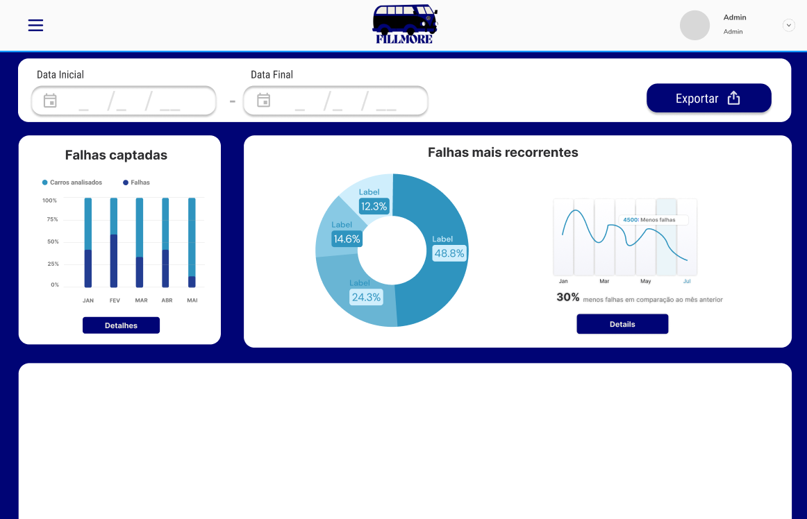

# Sistema de Análise de Qualidade de Veículos

## Introdução

O objetivo principal deste sistema é fornecer uma ferramenta eficiente e intuitiva para a inspeção de veículos na linha de produção. O sistema foi concebido para atender às necessidades de dois tipos de usuários: o operador da linha de produção e o gerente de qualidade.

Através de uma interface amigável e acessível, os operadores podem realizar o upload dos dados dos veículos para que o sistema execute uma análise automatizada, determinando a conformidade com os padrões estabelecidos. O feedback é fornecido em tempo real, permitindo que ações corretivas sejam tomadas imediatamente.

Para os gerentes de qualidade, o sistema oferece um dashboard robusto que permite a visualização de gráficos, relatórios e estatísticas detalhadas sobre a performance dos veículos ao longo do tempo. Essa funcionalidade proporciona uma visão global e detalhada do processo de produção, permitindo uma análise precisa e a identificação de tendências ou problemas recorrentes.

## Tipos de Usuários e Fluxo de Trabalho

### 1. Operador da Linha de Produção

**Fluxo de Trabalho:**

1. **Tela de Login**

   - **Descrição:** O operador inicia o processo na tela de login, onde insere suas credenciais para acessar o sistema.
   - **Próxima Etapa:** Após o login, o operador é redirecionado para a tela de upload de dados.

2. **Tela de Upload de Dados**

   - **Descrição:** Após o login, o operador é levado a uma interface simples e direta, onde pode fazer o upload dos dados do veículo. Esta tela contém um campo para seleção do arquivo e um botão para enviar os dados.
   - **Próxima Etapa:** Após o envio dos dados, o sistema processa a informação e apresenta um feedback imediato.

3. **Tela de Feedback**

   - **Descrição:** O sistema retorna um feedback instantâneo ao operador, indicando se o veículo passou ou falhou nos testes específicos. Se o carro não estiver conforme, são exibidas instruções ou sugestões para correções.
   - **Próxima Etapa:** O operador pode então decidir se realoiza novas ações com base no feedback recebido.

### 2. Gerente de Qualidade

**Fluxo de Trabalho:**

1. **Tela de Login**

   - **Descrição:** O gerente de qualidade também começa na tela de login, onde insere suas credenciais para acessar o sistema.
   - **Próxima Etapa:** Após o login, o gerente é redirecionado para o dashboard de análise.

2. **Dashboard de Análise**

   - **Descrição:** O dashboard oferece uma visão geral detalhada do desempenho dos veículos na linha de produção. Esta tela inclui gráficos, tabelas e outras visualizações de dados, como a porcentagem de conformidade e as falhas mais comuns.
   - **Próxima Etapa:** O gerente pode explorar os dados detalhadamente, clicando em diferentes elementos para visualizar informações específicas ou gerar relatórios.

## Considerações Finais

O Sistema de Análise de Qualidade de Veículos foi concebido para atender às necessidades críticas da linha de produção automotiva, proporcionando uma ferramenta eficiente tanto para operadores quanto para gerentes de qualidade. Através de uma interface intuitiva e processos automatizados, o sistema facilita a verificação da conformidade dos veículos em tempo real, garantindo que os padrões de qualidade sejam mantidos de maneira rigorosa.

A separação clara de funcionalidades entre os dois tipos de usuários assegura que cada grupo tenha acesso às ferramentas necessárias para executar suas tarefas de maneira eficaz. Os operadores têm uma interface simplificada para o upload de dados e obtenção de feedback imediato, enquanto os gerentes de qualidade dispõem de um dashboard avançado que oferece insights detalhados sobre o desempenho da produção.