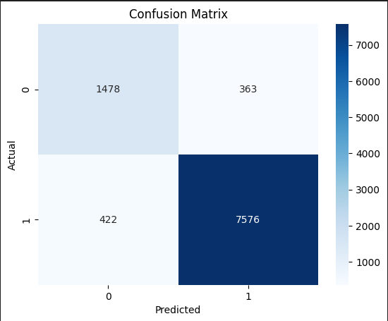

# Documentação do modelo

## 1. Introdução
Este documento descreve o desenvolvimento e a avaliação de um modelo de rede neural para prever falhas em um conjunto de dados industriais. O modelo foi construído usando TensorFlow/Keras e avaliado com métricas de performance, como acurácia e recall.

## 2. Preparação dos Dados

### 2.1. Carregamento dos Dados
Os dados foram carregados a partir de três arquivos CSV comprimidos:
- `RESULTADOS_04_06_2024_full_teste.csv`
- `RESULTADOS_02_03_2024_full_teste.csv`
- `RESULTADOS_06_2023_07_2023_full_teste.csv`

```python
df_resultados = pd.read_csv('RESULTADOS_04_06_2024_full_teste.csv', compression='gzip')
df_resultados2 = pd.read_csv('RESULTADOS_02_03_2024_full_teste.csv', compression='gzip')
df_resultados3 = pd.read_csv('RESULTADOS_06_2023_07_2023_full_teste.csv', compression='gzip')
```

### 2.2. Limpeza dos Dados

Foram removidas colunas desnecessárias e linhas com valores ausentes.

```python

df_resultados = df_resultados.drop(columns=['Unnamed: 0'], axis=1).dropna()
df_resultados2 = df_resultados2.drop(columns=['Unnamed: 0'], axis=1).dropna()
df_resultados3 = df_resultados3.drop(columns=['Unnamed: 0'], axis=1).dropna()
```

### 2.3. Unificação dos Dados

Os DataFrames individuais foram concatenados em um único DataFrame maior.

```python

df = pd.concat([df_resultados, df_resultados2, df_resultados3])
```

### 2.4. Transformação dos Dados

Foram criadas novas features a partir dos dados e realizadas transformações para integrar os dados de falhas.

```python

status_count = df.groupby(['KNR', 'ID', 'STATUS']).size().unstack(fill_value=0)
status_count.columns = [f'{int(col[1])}_status_{int(col[0])}' for col in status_count.columns]
status_count = status_count.reset_index()

unique_names = df.groupby('KNR').agg(unique_names=('NAME', 'nunique')).reset_index()
resultados_id_status = pd.merge(unique_names, status_count, on='KNR')

falhas = pd.read_csv('falhas_modelo.csv').drop(columns=['HALLE'])
falhas_pivot = pd.get_dummies(falhas, columns=['S_GROUP_ID']).groupby('KNR').sum().reset_index()
merged_df = pd.merge(resultados_id_status, falhas_pivot, on='KNR', how='left').fillna(0)
merged_df['FALHA'] = merged_df['KNR'].apply(lambda x: 1 if x in falhas_grouped['KNR'].values else 0)
```

## 3. Modelagem
### 3.1. Seleção de Features e Alvo

As features e a variável alvo foram selecionadas para a modelagem.

```python

features = ['unique_names', '1_status_10', '2_status_10', '718_status_10',
            '1_status_13', '2_status_13', '718_status_13']
target = 'FALHA'
X = merged_df[features]
y = merged_df[target].values
```

### 3.2. Divisão dos Dados

Os dados foram divididos em conjuntos de treino e teste, com 80% dos dados destinados ao treino.

```python

X_train, X_test, y_train, y_test = train_test_split(X, y, test_size=0.2, random_state=42)
```

### 3.3. Normalização

As features foram normalizadas utilizando StandardScaler.

```python

scaler = StandardScaler()
X_train_scaled = scaler.fit_transform(X_train)
X_test_scaled = scaler.transform(X_test)
```

### 3.4. Construção do Modelo

A rede neural foi construída com **três camadas** densas.

```python

model = Sequential([
    Dense(16, activation='relu', input_shape=(X_train_scaled.shape[1],)),
    Dense(8, activation='relu'),
    Dense(1, activation='sigmoid')
])
```

### 3.5. Compilação e Treinamento

O modelo foi compilado com o otimizador **Adam** e a função de perda **binary_crossentropy**, e treinado por 500 épocas.

```python

model.compile(optimizer='adam', loss='binary_crossentropy', metrics=['accuracy'])
model.fit(X_train_scaled, y_train, epochs=500, batch_size=16, validation_split=0.2)
```

## 4. Avaliação do Modelo
### 4.1. Avaliação no Conjunto de Teste

O modelo foi avaliado no conjunto de teste, obtendo uma acurácia de 93.26%.

```python

test_loss, test_acc = model.evaluate(X_test_scaled, y_test)
print(f'Test Accuracy: {test_acc:.4f}')
```

### 4.2. Predição e Matriz de Confusão

A matriz de confusão foi gerada para visualizar a performance do modelo, e as predições foram feitas no conjunto de teste.

```python

y_pred = (model.predict(X_test_scaled) > 0.5).astype("int32")
cm = confusion_matrix(y_test, y_pred)
sns.heatmap(cm, annot=True, fmt='d', cmap='Blues')
plt.xlabel('Predicted')
plt.ylabel('Actual')
plt.title('Confusion Matrix')
plt.show()
```

### 4.3. Métrica de Recall

O recall foi calculado para avaliar a capacidade do modelo de identificar corretamente as falhas.

```python

recall = recall_score(y_test, y_pred)
print(f'Recall: {recall:.4f}')
```

## 5. Resultados
### 5.1. Acurácia

A acurácia do modelo no conjunto de teste foi de **93.26%**, indicando uma alta taxa de acerto nas previsões.

### 5.2. Matriz de Confusão

A matriz de confusão revelou que o modelo tem uma boa capacidade de discriminar entre as classes de falha e não falha, com um número considerável de verdadeiros positivos e verdadeiros negativos.



### 5.3. Recall

O recall do modelo foi de **94.72%**, mostrando que o modelo é muito eficiente em identificar corretamente os casos de falha, com uma baixa taxa de falsos negativos.

## 6. Salvamento do Modelo

O modelo treinado foi salvo em um arquivo .pt para ser utilizado posteriormente para a integração com o backend.

```python

torch.save(model.state_dict(), 'model.pt')
```
