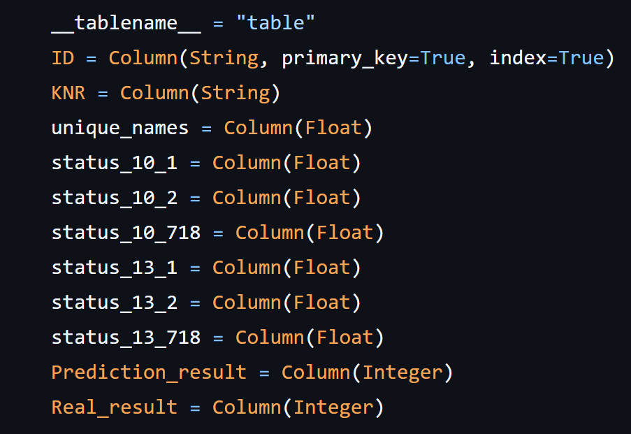
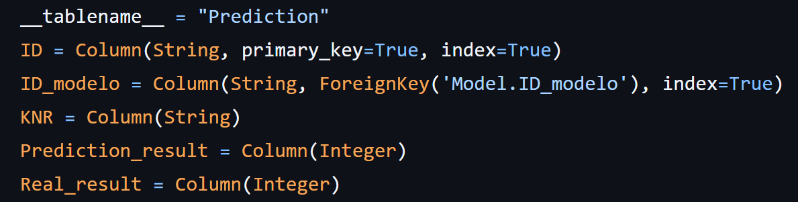
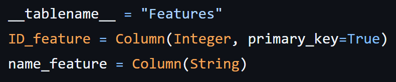
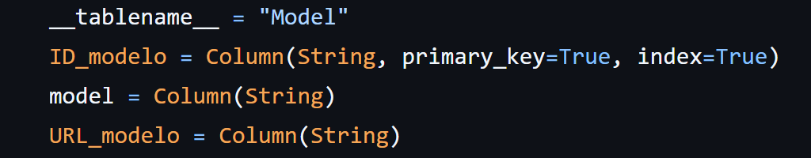
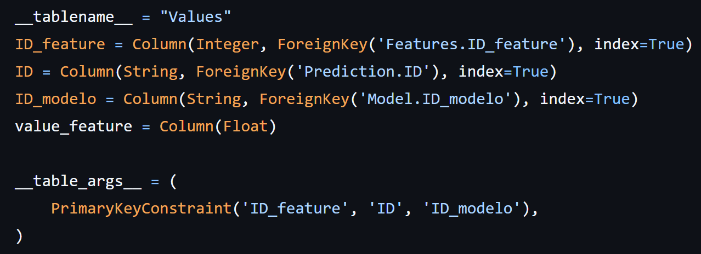

# Introdução

A modelagem do banco de dados foi criada inicialmente com uma tabela apenas, contendo informações de identificação da predição (`ID`), o carro que foi analisado (`KNR`), as features do modelo (uma coluna para cada feature), o resultado da predição e o resultado após os testes, como pode ser observado abaixo:

Porém, com o avanço do projeto, foi observada a necessidade de nossa aplicação usar mais de um modelo. Sendo assim, teria que ser adicionada a informação de qual modelo foi utilizado e suas features, que podem variar de modelo para modelo. Portanto, o banco de dados foi remodelado para atender a esses requisitos.

# Novo banco de dados

Após a remodelagem do banco de dados, foram criadas 4 tabelas:

- `Prediction`: contém a identificação da predição em si, o identificador da predição, o identificador do carro, o resultado da predição e o resultado real.

- `Features`: contém o identificador da feature e seu nome.

- `Model`: contém o identificador do modelo, o nome do modelo e a sua URL.

- `Values`: contém as features e seus valores, o identificador da predição e o identificador do modelo.

## Prediction

Essa tabela foi criada com o intuito de armazenar todas as informações relacionadas à predição em si. Sendo assim, há um ID como chave primária que é o identificador da predição, o carro em que a predição foi feita, o modelo utilizado para essa predição, o resultado da predição e o resultado real. 

Com essas informações, é possível ter acesso a todas as informações relacionadas à predição diretamente. O resultado real refere-se ao fato de, após os testes realizados, haver ou não realmente uma falha no carro. Foi pensado em armazenar essa informação também para facilitar à Volkswagen medir se o modelo está sendo performático ou não.

## Features

Essa tabela foi criada com o intuito de armazenar todas as features que vão ser utilizadas, independentemente do modelo. Como pode ser observado na figura acima, a tabela `Features` não apresenta a informação da feature como uma coluna, mas sim como uma linha. Sendo assim, caso no futuro seja criado um modelo que utilize features diferentes das presentes no banco de dados, a modelagem do banco permite que seja adicionada uma linha com a nova feature, fazendo com que essa nova informação consiga entrar no banco de dados facilmente, sem a necessidade de remodelar o banco em si.

## Model

Essa tabela foi criada com o intuito de armazenar todos os modelos que vão ser utilizados no projeto. Sendo assim, do mesmo jeito que a tabela `Features` foi modelada, a tabela `Model` também foi criada para ser extensível. Porém, a tabela `Model` apresenta uma informação a mais: a URL. Essa URL faz referência à URL presente no Pocketbase, sistema usado para armazenar os modelos. Com essa URL, o backend da aplicação consegue utilizar o modelo sem ter que carregá-lo nativamente no backend. Para um modelo só, não faz tanta diferença, porém, quando forem adicionados vários modelos, carregar apenas o que será utilizado pela URL dará ganho de performance para a aplicação.

## Values

Essa tabela foi criada com o intuito de armazenar os valores das features que foram utilizados para realizar a predição. Sendo assim, essa tabela armazena o ID da predição, o ID do modelo utilizado, o ID da feature e seu valor. Porém, nenhuma dessas informações é um identificador único para a tabela `Values`, pois utiliza 3 foreign keys, mas nenhuma primary key. 

Para resolver o problema, foi criada a compound key, que é uma união dos valores das 3 foreign keys presentes na tabela. Para ela ser um valor único, basta que uma das 3 foreign keys não se repita. Exemplificando: quando é feita uma predição com um determinado modelo e 5 features, haverá 5 linhas de conteúdo no banco de dados, com o ID da predição igual, o ID do modelo igual, mas o ID da feature será diferente. Quando realizada outra predição com o mesmo modelo, o ID do modelo e das features nas 5 linhas será igual em comparação com as 5 linhas da predição anterior, mas o ID da predição em si será diferente. Como uma das 3 foreign keys é diferente, o nosso banco terá um identificador único, já que é a junção das informações das 3 foreign keys.

# Relação entre as tabelas

Além da relação de primary key e foreign key normal de um banco de dados estruturado, foram definidas explicitamente relações entre as tabelas na criação do banco para facilitar a coleta de informações das tabelas no backend. Exemplificando, caso eu precise do KNR - que está presente na tabela `Prediction` - e do valor das features - que está presente na tabela `Values` -, se eu definir que as duas tabelas têm uma relação entre elas, a coleta de informações se torna facilitada, mesmo que sejam valores de duas tabelas diferentes. Sendo assim, a definição da relação das tabelas serve para ajudar a captar as informações que estão espalhadas pelas 4 tabelas criadas. Dito isso, caso no futuro haja necessidade de relacionar mais alguma tabela, ajustes serão feitos nessas relações, então o que está aqui é somente uma versão inicial e pode sofrer alterações no futuro.

As relações presentes atualmente são entre apenas duas tabelas: `Prediction` e `Values`. A tabela `Prediction` faz uma relação unilateral com a tabela `Model`, ou seja, caso eu chame a tabela `Prediction`, mas eu queira informações do nome do modelo, essa informação será trazida mais facilmente. Porém, como é uma relação unilateral, caso eu chame a tabela `Model`, eu não consigo acessar as informações da `Prediction` tão facilmente. Na mesma lógica, `Values` tem uma chamada unilateral com `Features` e `Model`, para conseguir acessar as informações do nome das features e do modelo mais facilmente. Foi criada de forma unilateral, pois as rotas do backend, quando chamam as tabelas `Features` e `Model`, não precisam de informações adicionais que estão fora dessas tabelas. 

Nessa linha, as tabelas `Prediction` e `Values` também apresentam uma relação, porém essa relação é bidimensional nesse caso, já que nas rotas apresentadas comumente é necessário obter informações de `Values` quando a `Prediction` é chamada e vice-versa.
