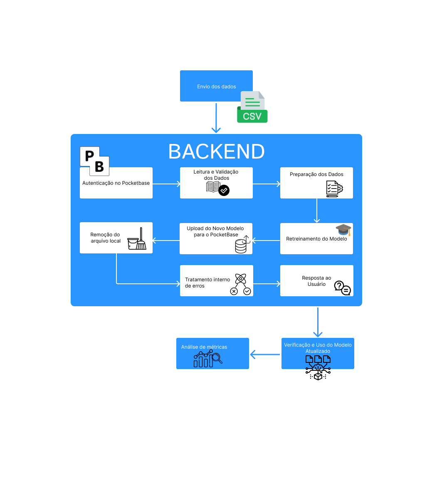

# Fluxo de Usuário para o Retreinamento do Modelo

O processo de retreinamento do modelo permite atualizar um modelo de machine learning com novos dados, melhorando a precisão e a adaptabilidade. Abaixo está uma visão detalhada do fluxo e as etapas envolvidas:

## Diagrama de Fluxo


O diagrama acima fornece uma visualização do fluxo completo do processo de retreinamento, incluindo etapas como leitura e validação dos dados, processamento, retreinamento, upload do modelo atualizado e resposta ao usuário.

---

## 1. Preparação dos Dados
- **Envio de Dados**: O usuário deve preparar um arquivo CSV contendo os novos dados para retreinar o modelo.
  - **Formato do CSV**:
    ```
    KNR,unique_names,1_status_10,2_status_10,718_status_10,1_status_13,2_status_13,718_status_13
    ```
  - **Exemplo de Linha**:
    ```
    2024.12,3,0.0,12.0,13.0,2.0,0.0,0.0
    ```
  - A coluna `718_status_13` é a variável alvo, enquanto as demais colunas são características.

## 2. Acesso ao Endpoint de Retreinamento
- **Requisição HTTP POST** para iniciar o retreinamento:
```
POST /models/{id_modelo}/retrain
```
- Substituir `{id_modelo}` pelo identificador do modelo a ser retreinado.

- **Formato da Requisição**:
- O arquivo CSV deve ser enviado como `multipart/form-data`.

- **Exemplo com `curl`**:
```bash
curl -X POST "http://localhost:8000/models/{id_modelo}/retrain" \
  -F "file=@caminho_para_seu_arquivo.csv"
```
## 3. Processamento no Backend

- **Autenticação no PocketBase**:
  - O backend autentica-se no PocketBase para obter permissão de acesso e manipulação dos arquivos de modelo.

- **Leitura e Validação dos Dados**:
  - O arquivo CSV enviado pelo usuário é lido e validado para garantir que todas as colunas necessárias estão presentes e formatadas corretamente.
  - Caso falte alguma coluna ou existam problemas no formato, uma mensagem de erro é retornada ao usuário.

- **Preparação dos Dados**:
  - As características (features) são extraídas das colunas especificadas no arquivo CSV.
  - A variável alvo (label), `718_status_13`, é isolada para ser utilizada no treinamento.
  - Os dados são convertidos para arrays do NumPy e passam por pré-processamento, como normalização, caso necessário.

- **Retreinamento do Modelo**:
  - O modelo existente é carregado para retreinamento com os novos dados fornecidos.
  - Parâmetros do treinamento, como o número de épocas (`epochs`) e o tamanho do lote (`batch size`), são configurados conforme necessário.
  - O processo de retreinamento começa, ajustando os pesos do modelo para melhorar sua precisão com os novos dados.

- **Salvamento do Novo Modelo**:
  - Após o retreinamento, o novo modelo é salvo localmente em formato `.h5` dentro da pasta `model`.

- **Upload do Novo Modelo para o PocketBase**:
  - O modelo atualizado é enviado para o PocketBase.
  - A URL do modelo é atualizada no banco de dados para refletir o novo arquivo de modelo.

- **Remoção do Arquivo Local**:
  - O arquivo de modelo salvo localmente é removido para liberar espaço e manter a organização.

## 4. Resposta ao Usuário
- O sistema retorna uma mensagem indicando que o retreinamento foi concluído com sucesso.
- A resposta pode incluir a nova URL do modelo para referência futura.

## 5. Verificação e Uso do Modelo Atualizado
- **Uso nas Previsões**:
  - Após o retreinamento, o modelo atualizado torna-se disponível para uso imediato nos endpoints de previsão existentes.

## 6. Tratamento de Erros
- O backend lida com possíveis erros durante o processo, retornando mensagens apropriadas para o usuário. Exemplos de erros incluem:
  - Formato incorreto do arquivo CSV ou colunas ausentes.
  - Falhas na autenticação com o PocketBase.
  - Problemas ao carregar ou salvar o modelo.
  - Dados incompatíveis que podem causar falhas durante o treinamento.

## 7. Considerações de Segurança
- **Autorização**:
  - O retreinamento deve ser restrito a usuários autenticados e autorizados.
  
- **Validação dos Dados**:
  - Forneça dados precisos e validados para evitar comprometer a integridade do modelo durante o retreinamento.

## 8. Boas Práticas
- **Controle de Versão**: 
  - Mantenha um registro das versões dos modelos para garantir a rastreabilidade das mudanças.
- **Testes Pós-Retreinamento**: 
  - Após o retreinamento, é recomendável testar o novo modelo com diferentes cenários para verificar seu desempenho e precisão.
- **Backup de Modelos Anteriores**:
  - Considere fazer backups das versões anteriores do modelo para reverter alterações, caso necessário.

---

## Resumo
O fluxo de retreinamento possibilita a atualização do modelo de machine learning, permitindo previsões mais precisas e adaptadas a novos dados. Ao enviar um arquivo CSV formatado para o endpoint de retreinamento, o sistema processa os dados, retreina o modelo e o disponibiliza para uso futuro.

---

### Notas:
- **Formato CSV**: Certifique-se de que o CSV siga o formato correto para que o backend processe os dados sem erros.
- **Autorização**: Apenas usuários autenticados devem ter acesso ao endpoint de retreinamento para manter a segurança e a integridade do processo.