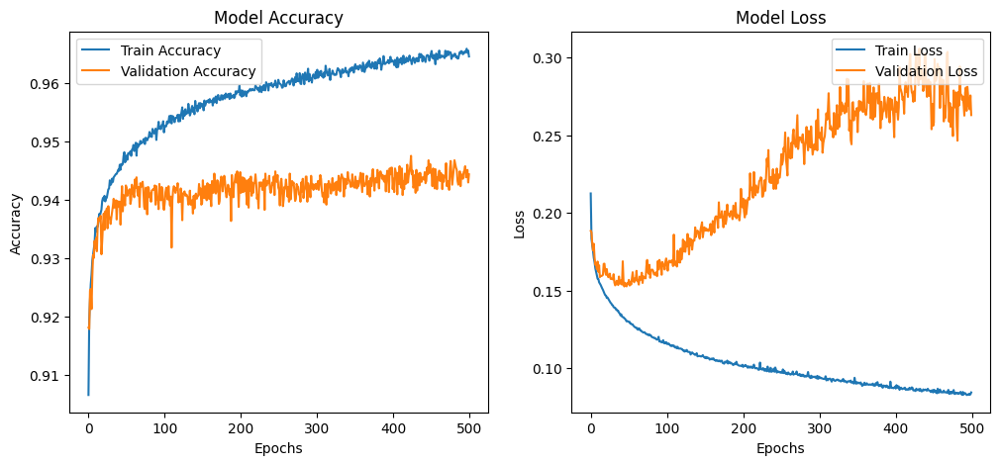
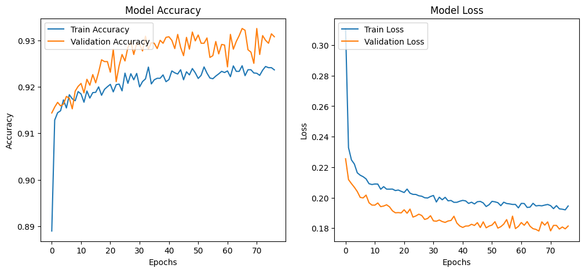

# Evolução do Modelo

Durante essa Sprint, o principal foco foi em reduzir o overfitting do modelo. Para tal, foram empregadas 3 técnicas:

## 1. Early Stopping

O **Early Stopping** é uma técnica que monitora a performance do modelo em um conjunto de validação e interrompe o treinamento quando o desempenho do modelo começa a deteriorar. Ou seja, o treinamento é finalizado assim que o erro no conjunto de validação começa a aumentar, indicando que o modelo está começando a overfittar os dados de treinamento. Essa abordagem evita que o modelo continue ajustando-se aos dados de treinamento além do necessário.

**Vantagens**:
- Previne o treinamento excessivo.
- Reduz o risco de memorizar dados de treinamento.
- Melhora a capacidade de generalização.

## 2. Redução de Complexidade

Modelos complexos, com muitos parâmetros e alta capacidade de aprendizado, são mais propensos a overfitting. Uma maneira eficaz de controlar isso é **reduzir a complexidade do modelo**, utilizando:
- **Redução do número de camadas** (em redes neurais).
- **Diminuir o número de neurônios** por camada.
- **Remover features irrelevantes** ou correlacionadas (em modelos baseados em features).
  
Ao fazer isso, o modelo fica menos propenso a memorizar os dados de treinamento e foca nos padrões mais relevantes para a tarefa.

**Vantagens**:
- Reduz o risco de overfitting ao evitar que o modelo fique grande demais.
- Melhora a interpretabilidade do modelo.

## 3. Regularização

A **Regularização** é uma técnica que adiciona uma penalização ao erro do modelo durante o processo de treinamento, incentivando o modelo a encontrar soluções mais simples e generalizáveis. As duas formas principais de regularização que utilizei foram:
- **L2 Regularization (Ridge)**: Adiciona uma penalidade baseada na soma dos quadrados dos pesos do modelo. Isso faz com que o modelo tenda a reduzir a magnitude dos pesos, resultando em um modelo mais simples e menos propenso a overfitting.
- **L1 Regularization (Lasso)**: Adiciona uma penalidade baseada na soma dos valores absolutos dos pesos. Isso incentiva o modelo a definir alguns pesos como exatamente zero, o que efetivamente realiza seleção de características.

**Vantagens**:
- Mantém o modelo mais simples e robusto.
- Previne que o modelo ajuste-se demais aos dados de treinamento.
- Ajuda na seleção de features com L1 regularization.

---

Com essas técnicas combinadas, consegui melhorar a capacidade do modelo de generalizar para novos dados, reduzindo o overfitting e mantendo uma boa performance nos dados de validação.

## Antes das Mudanças

## Após as Mudanças

## Métricas Finais

Acurácia: 94% e
Recall: 97%